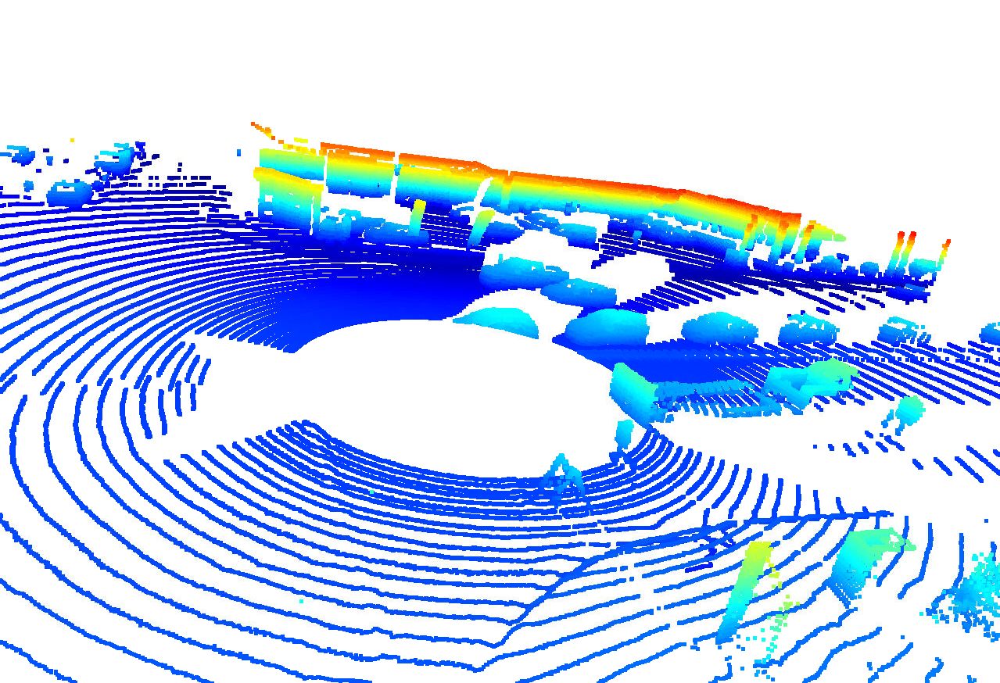
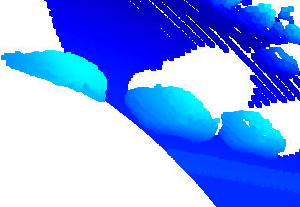
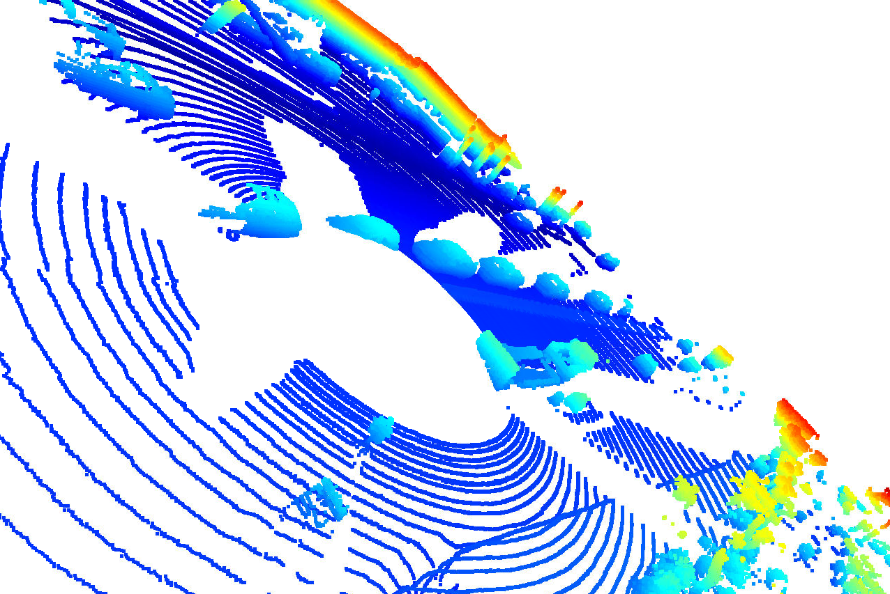
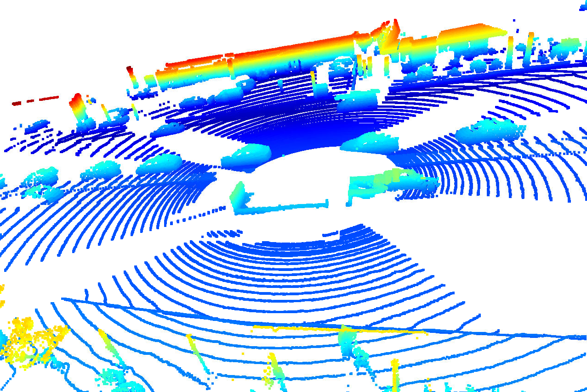
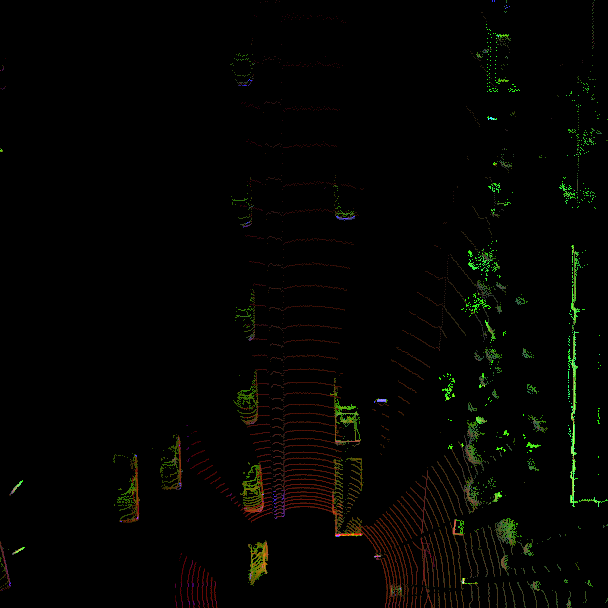
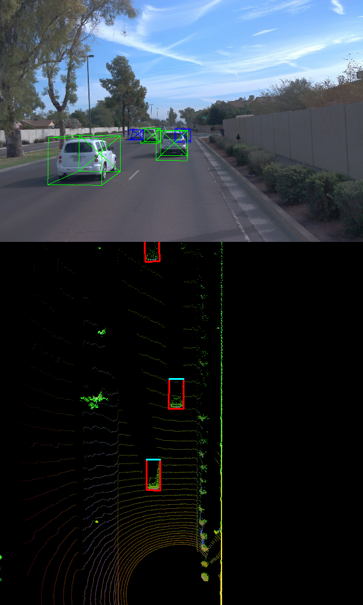
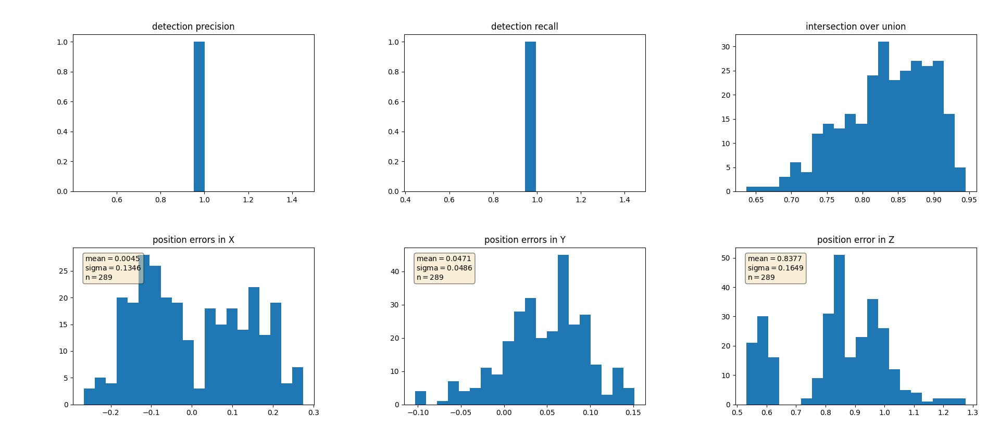

# SDCND : Sensor Fusion and Tracking
This is the project for the second course in the  [Udacity Self-Driving Car Engineer Nanodegree Program](https://www.udacity.com/course/c-plus-plus-nanodegree--nd213) : Sensor Fusion and Tracking.

In this project, you'll fuse measurements from LiDAR and camera and track vehicles over time. You will be using real-world data from the Waymo Open Dataset, detect objects in 3D point clouds and apply an extended Kalman filter for sensor fusion and tracking.


The project consists of two major parts:
1. **Object detection**: In this part, a deep-learning approach is used to detect vehicles in LiDAR data based on a birds-eye view perspective of the 3D point-cloud. Also, a series of performance measures is used to evaluate the performance of the detection approach.
2. **Object tracking** : In this part, an extended Kalman filter is used to track vehicles over time, based on the lidar detections fused with camera detections. Data association and track management are implemented as well.

The following diagram contains an outline of the data flow and of the individual steps that make up the algorithm.


Also, the project code contains various tasks, which are detailed step-by-step in the code. More information on the algorithm and on the tasks can be found in the Udacity classroom.

## Project File Structure

📦project<br>
 ┣ 📂dataset --> contains the Waymo Open Dataset sequences <br>
 ┃<br>
 ┣ 📂misc<br>
 ┃ ┣ evaluation.py --> plot functions for tracking visualization and RMSE calculation<br>
 ┃ ┣ helpers.py --> misc. helper functions, e.g. for loading / saving binary files<br>
 ┃ ┗ objdet_tools.py --> object detection functions without student tasks<br>
 ┃ ┗ params.py --> parameter file for the tracking part<br>
 ┃ <br>
 ┣ 📂results --> binary files with pre-computed intermediate results<br>
 ┃ <br>
 ┣ 📂student <br>
 ┃ ┣ association.py --> data association logic for assigning measurements to tracks incl. student tasks <br>
 ┃ ┣ filter.py --> extended Kalman filter implementation incl. student tasks <br>
 ┃ ┣ measurements.py --> sensor and measurement classes for camera and lidar incl. student tasks <br>
 ┃ ┣ objdet_detect.py --> model-based object detection incl. student tasks <br>
 ┃ ┣ objdet_eval.py --> performance assessment for object detection incl. student tasks <br>
 ┃ ┣ objdet_pcl.py --> point-cloud functions, e.g. for birds-eye view incl. student tasks <br>
 ┃ ┗ trackmanagement.py --> track and track management classes incl. student tasks  <br>
 ┃ <br>
 ┣ 📂tools --> external tools<br>
 ┃ ┣ 📂objdet_models --> models for object detection<br>
 ┃ ┃ ┃<br>
 ┃ ┃ ┣ 📂darknet<br>
 ┃ ┃ ┃ ┣ 📂config<br>
 ┃ ┃ ┃ ┣ 📂models --> darknet / yolo model class and tools<br>
 ┃ ┃ ┃ ┣ 📂pretrained --> copy pre-trained model file here<br>
 ┃ ┃ ┃ ┃ ┗ complex_yolov4_mse_loss.pth<br>
 ┃ ┃ ┃ ┣ 📂utils --> various helper functions<br>
 ┃ ┃ ┃<br>
 ┃ ┃ ┗ 📂resnet<br>
 ┃ ┃ ┃ ┣ 📂models --> fpn_resnet model class and tools<br>
 ┃ ┃ ┃ ┣ 📂pretrained --> copy pre-trained model file here <br>
 ┃ ┃ ┃ ┃ ┗ fpn_resnet_18_epoch_300.pth <br>
 ┃ ┃ ┃ ┣ 📂utils --> various helper functions<br>
 ┃ ┃ ┃<br>
 ┃ ┗ 📂waymo_reader --> functions for light-weight loading of Waymo sequences<br>
 ┃<br>
 ┣ basic_loop.py<br>
 ┣ loop_over_dataset.py<br>


## Installation Instructions for Running Locally
### Cloning the Project
In order to create a local copy of the project, please click on "Code" and then "Download ZIP". Alternatively, you may of-course use GitHub Desktop or Git Bash for this purpose.

### Python
The project has been written using Python 3.7. Please make sure that your local installation is equal or above this version.

### Package Requirements
All dependencies required for the project have been listed in the file `requirements.txt`. You may either install them one-by-one using pip or you can use the following command to install them all at once:
`pip3 install -r requirements.txt`

### Waymo Open Dataset Reader
The Waymo Open Dataset Reader is a very convenient toolbox that allows you to access sequences from the Waymo Open Dataset without the need of installing all of the heavy-weight dependencies that come along with the official toolbox. The installation instructions can be found in `tools/waymo_reader/README.md`.

### Waymo Open Dataset Files
This project makes use of three different sequences to illustrate the concepts of object detection and tracking. These are:
- Sequence 1 : `training_segment-1005081002024129653_5313_150_5333_150_with_camera_labels.tfrecord`
- Sequence 2 : `training_segment-10072231702153043603_5725_000_5745_000_with_camera_labels.tfrecord`
- Sequence 3 : `training_segment-10963653239323173269_1924_000_1944_000_with_camera_labels.tfrecord`

To download these files, you will have to register with Waymo Open Dataset first: [Open Dataset – Waymo](https://waymo.com/open/terms), if you have not already, making sure to note "Udacity" as your institution.

Once you have done so, please [click here](https://console.cloud.google.com/storage/browser/waymo_open_dataset_v_1_2_0_individual_files) to access the Google Cloud Container that holds all the sequences. Once you have been cleared for access by Waymo (which might take up to 48 hours), you can download the individual sequences.

The sequences listed above can be found in the folder "training". Please download them and put the `tfrecord`-files into the `dataset` folder of this project.


### Pre-Trained Models
The object detection methods used in this project use pre-trained models which have been provided by the original authors. They can be downloaded [here](https://drive.google.com/file/d/1Pqx7sShlqKSGmvshTYbNDcUEYyZwfn3A/view?usp=sharing) (darknet) and [here](https://drive.google.com/file/d/1RcEfUIF1pzDZco8PJkZ10OL-wLL2usEj/view?usp=sharing) (fpn_resnet). Once downloaded, please copy the model files into the paths `/tools/objdet_models/darknet/pretrained` and `/tools/objdet_models/fpn_resnet/pretrained` respectively.

### Using Pre-Computed Results

In the main file `loop_over_dataset.py`, you can choose which steps of the algorithm should be executed. If you want to call a specific function, you simply need to add the corresponding string literal to one of the following lists:

- `exec_data` : controls the execution of steps related to sensor data.
  - `pcl_from_rangeimage` transforms the Waymo Open Data range image into a 3D point-cloud
  - `load_image` returns the image of the front camera

- `exec_detection` : controls which steps of model-based 3D object detection are performed
  - `bev_from_pcl` transforms the point-cloud into a fixed-size birds-eye view perspective
  - `detect_objects` executes the actual detection and returns a set of objects (only vehicles)
  - `validate_object_labels` decides which ground-truth labels should be considered (e.g. based on difficulty or visibility)
  - `measure_detection_performance` contains methods to evaluate detection performance for a single frame

In case you do not include a specific step into the list, pre-computed binary files will be loaded instead. This enables you to run the algorithm and look at the results even without having implemented anything yet. The pre-computed results for the mid-term project need to be loaded using [this](https://drive.google.com/drive/folders/1-s46dKSrtx8rrNwnObGbly2nO3i4D7r7?usp=sharing) link. Please use the folder `darknet` first. Unzip the file within and put its content into the folder `results`.

- `exec_tracking` : controls the execution of the object tracking algorithm

- `exec_visualization` : controls the visualization of results
  - `show_range_image` displays two LiDAR range image channels (range and intensity)
  - `show_labels_in_image` projects ground-truth boxes into the front camera image
  - `show_objects_and_labels_in_bev` projects detected objects and label boxes into the birds-eye view
  - `show_objects_in_bev_labels_in_camera` displays a stacked view with labels inside the camera image on top and the birds-eye view with detected objects on the bottom
  - `show_tracks` displays the tracking results
  - `show_detection_performance` displays the performance evaluation based on all detected
  - `make_tracking_movie` renders an output movie of the object tracking results

Even without solving any of the tasks, the project code can be executed.

The final project uses pre-computed lidar detections in order for all students to have the same input data. If you use the workspace, the data is prepared there already. Otherwise, [download the pre-computed lidar detections](https://drive.google.com/drive/folders/1IkqFGYTF6Fh_d8J3UjQOSNJ2V42UDZpO?usp=sharing) (~1 GB), unzip them and put them in the folder `results`.

## External Dependencies
Parts of this project are based on the following repositories:
- [Simple Waymo Open Dataset Reader](https://github.com/gdlg/simple-waymo-open-dataset-reader)
- [Super Fast and Accurate 3D Object Detection based on 3D LiDAR Point Clouds](https://github.com/maudzung/SFA3D)
- [Complex-YOLO: Real-time 3D Object Detection on Point Clouds](https://github.com/maudzung/Complex-YOLOv4-Pytorch)

# Track 3D-Objects Over Time

This is a writeup submission for sensor fusion course  [Udacity Self-Driving Car Engineer Nanodegree Program](https://www.udacity.com/course/c-plus-plus-nanodegree--nd213) : 3D Object Detection (Midterm).

## 3D Object detection

We have used the [Waymo Open Dataset's](https://console.cloud.google.com/storage/browser/waymo_open_dataset_v_1_2_0_individual_files) real-world data and used 3d point cloud for lidar based object detection.

The steps included were -

- Map the ranges channel to 8 bit and view the range /intensity image (ID_S1_EX1)
- Use the Open3D library to display a 3d rendering of 10 lidar point clouds (ID_S1_EX2)
- Create Birds Eye View perspective (BEV) of the point cloud, assign lidar intensity values to BEV, normalize the heightmap of each BEV (ID_S2_EX1,ID_S2_EX2,ID_S2_EX3)
- Use [YOLO repository](https://review.udacity.com/github.com/maudzung/SFA3D) and add parameters to setup fpn resnet model(ID_S3_EX1)
- Convert BEV coordinates into pixel coordinates and convert model output to generate bounding boxes (ID_S3_EX2)
- Compute intersection over union, treat detections as objects if IOU exceeds threshold (ID_S4_EX1)
- Compute false positives and false negatives, precision and recall(ID_S4_EX2,ID_S4_EX3)


The project can be run by executing

```
python loop_over_dataset.py
```

All training was done in the workspace provided by Udacity


## Step-1: Compute Lidar point cloud from Range Image

In this step, we first previewing the range image and then convert range and intensity channels to 8 bit format. Next, we use the openCV library to stack the range and intensity channel vertically to visualize the image.

- Convert "range" channel to 8 bit
- Convert "intensity" channel to 8 bit
- Stack up range and intensity channels vertically in openCV


Changes to the "objdet_pcl.py" file
```
# visualize lidar point-cloud
def show_pcl(pcl):

    ####### ID_S1_EX2 START #######     
    #######
    print("student task ID_S1_EX2")

    # step 1 : initialize open3d with key callback and create window
    vis_lpc = o3d.visualization.VisualizerWithKeyCallback()
    vis_lpc.create_window(window_name='Open3D', width=1280, height=1080, left=50, top=50, visible=True)

    global idx
    idx= True
    def right_click(vis_lpc):
        global idx
        print('right arrow pressed')
        idx= False
        return
    vis_lpc.register_key_callback(262,right_click)

    # step 2 : create instance of open3d point-cloud class
    pcd = o3d.geometry.PointCloud()

    # step 3 : set points in pcd instance by converting the point-cloud into 3d vectors (using open3d function Vector3dVector)
    pcd.points = o3d.utility.Vector3dVector(pcl[:,:3])

    # step 4 : for the first frame, add the pcd instance to visualization using add_geometry; for all other frames, use update_geometry instead
    vis_lpc.add_geometry(pcd)

    # step 5 : visualize point cloud and keep window open until right-arrow is pressed (key-code 262)
    while idx:
        vis_lpc.poll_events()
        vis_lpc.update_renderer()

    #######
    ####### ID_S1_EX2 END #######     
```

Using the following settings
```
data_filename = 'training_segment-1005081002024129653_5313_150_5333_150_with_camera_labels.tfrecord
show_only_frames = [0, 1]
exec_data = []
exec_detection = []
exec_tracking = []
exec_visualization = ['show_range_image']
```


This is a 3D image generated from the point cloud.


The two objects in the picture are two cars.



We see 3 more cars in the picture.



This is another 3D image from another frame.



This 3D image from another frame shows 6 cars in a lane in traffic.


Zooming in we get to see 3 cars in that frame.


Two more cars.


One feature we see in all of the these cars is the bumper on the back. We can also figure out windows from these cars. Since windows are made of transparent glass. The LiDAR does not glass since the light goes through.


Next we visualize the point cloud in Open3D and show 10 examples of vehicles in the point clouds


## Step-2: Create Birds-Eye View from Lidar PCL

In this step we create the BEV perspective of the point cloud image.

We do this by -

- Convert the coordinates to pixel values
- Assign lidar intensity values to the birds eye view BEV mapping
- Use sorted and pruned intensity values from the previous task
- Normalize the height map in the BEV
- Compute and map the intensity values


Changes to the "objdet_pcl.py" file

```
# create birds-eye view of lidar data
def bev_from_pcl(lidar_pcl, configs):

    # remove lidar points outside detection area and with too low reflectivity
    mask = np.where((lidar_pcl[:, 0] >= configs.lim_x[0]) & (lidar_pcl[:, 0] <= configs.lim_x[1]) &
                    (lidar_pcl[:, 1] >= configs.lim_y[0]) & (lidar_pcl[:, 1] <= configs.lim_y[1]) &
                    (lidar_pcl[:, 2] >= configs.lim_z[0]) & (lidar_pcl[:, 2] <= configs.lim_z[1]))
    lidar_pcl = lidar_pcl[mask]

    # shift level of ground plane to avoid flipping from 0 to 255 for neighboring pixels
    lidar_pcl[:, 2] = lidar_pcl[:, 2] - configs.lim_z[0]  

    # convert sensor coordinates to bev-map coordinates (center is bottom-middle)
    ####### ID_S2_EX1 START #######     
    #######
    print("student task ID_S2_EX1")

    ## step 1 :  compute bev-map discretization by dividing x-range by the bev-image height (see configs)
    bev_discret = (configs.lim_x[1] - configs.lim_x[0]) / configs.bev_height

    ## step 2 : create a copy of the lidar pcl and transform all metrix x-coordinates into bev-image coordinates    
    lidar_pcl_cpy = np.copy(lidar_pcl)
    lidar_pcl_cpy[:, 0] = np.int_(np.floor(lidar_pcl_cpy[:, 0] / bev_discret))

    # step 3 : perform the same operation as in step 2 for the y-coordinates but make sure that no negative bev-coordinates occur
    lidar_pcl_cpy[:, 1] = np.int_(np.floor(lidar_pcl_cpy[:, 1] / bev_discret) + (configs.bev_width + 1) / 2)
    lidar_pcl_cpy[:, 1] = np.abs(lidar_pcl_cpy[:,1])

    # step 4 : visualize point-cloud using the function show_pcl from a previous task
    show_pcl(lidar_pcl_cpy)
    #######
    ####### ID_S2_EX1 END #######     


    # Compute intensity layer of the BEV map
    ####### ID_S2_EX2 START #######     
    #######
    print("student task ID_S2_EX2")

    ## step 1 : create a numpy array filled with zeros which has the same dimensions as the BEV map
    intensity_map = np.zeros((configs.bev_height, configs.bev_width))   

    # step 2 : re-arrange elements in lidar_pcl_cpy by sorting first by x, then y, then -z (use numpy.lexsort)
    lidar_pcl_cpy[lidar_pcl_cpy[:,3]>1.0,3] = 1.0
    idx_intensity = np.lexsort((-lidar_pcl_cpy[:, 2], lidar_pcl_cpy[:, 1], lidar_pcl_cpy[:, 0]))
    lidar_pcl_top = lidar_pcl_cpy[idx_intensity]

    ## step 3 : extract all points with identical x and y such that only the top-most z-coordinate is kept (use numpy.unique)
    ##          also, store the number of points per x,y-cell in a variable named "counts" for use in the next task
    lidar_pcl_int, indices, count = np.unique(lidar_pcl_cpy[:, 0:2], axis=0, return_index=True, return_counts=True)
    lidar_pcl_top = lidar_pcl_cpy[indices]

    ## step 4 : assign the intensity value of each unique entry in lidar_top_pcl to the intensity map
    ##          make sure that the intensity is scaled in such a way that objects of interest (e.g. vehicles) are clearly visible    
    ##          also, make sure that the influence of outliers is mitigated by normalizing intensity on the difference between the max. and min. value within the point cloud
    intensity_map[np.int_(lidar_pcl_top[:, 0]),
                  np.int_(lidar_pcl_top[:, 1])] = lidar_pcl_top[:, 3] / (np.amax(lidar_pcl_top[:, 3])-np.amin(lidar_pcl_top[:, 3]))

    ## step 5 : temporarily visualize the intensity map using OpenCV to make sure that vehicles separate well from the background
    img_intensity = intensity_map * 256
    img_intensity = img_intensity.astype(np.uint8)
    # cv2.imshow('img_intensity', img_intensity)
    # cv2.waitKey(0)
    # cv2.destroyAllWindows()
    #######
    ####### ID_S2_EX2 END #######


    # Compute height layer of the BEV map
    ####### ID_S2_EX3 START #######     
    #######
    print("student task ID_S2_EX3")

    ## step 1 : create a numpy array filled with zeros which has the same dimensions as the BEV map
    height_map = np.zeros((configs.bev_height, configs.bev_width))

    ## step 2 : assign the height value of each unique entry in lidar_top_pcl to the height map
    ##          make sure that each entry is normalized on the difference between the upper and lower height defined in the config file
    ##          use the lidar_pcl_top data structure from the previous task to access the pixels of the height_map
    height_map[np.int_(lidar_pcl_top[:, 0]), np.int_(lidar_pcl_top[:, 1])] = lidar_pcl_top[:, 2] / float(np.abs(configs.lim_z[1] - configs.lim_z[0]))

    ## step 3 : temporarily visualize the intensity map using OpenCV to make sure that vehicles separate well from the background
    img_height = height_map * 256
    img_height = img_height.astype(np.uint8)
    # cv2.imshow('height_map', height_map)
    # cv2.waitKey(0)
    # cv2.destroyAllWindows()

    #######
    ####### ID_S2_EX3 END #######       

    # TODO remove after implementing all of the above steps

    # Compute density layer of the BEV map
    density_map = np.zeros((configs.bev_height + 1, configs.bev_width + 1))
    _, _, counts = np.unique(lidar_pcl_cpy[:, 0:2], axis=0, return_index=True, return_counts=True)
    normalizedCounts = np.minimum(1.0, np.log(counts + 1) / np.log(64))
    density_map[np.int_(lidar_pcl_top[:, 0]), np.int_(lidar_pcl_top[:, 1])] = normalizedCounts

    # assemble 3-channel bev-map from individual maps
    bev_map = np.zeros((3, configs.bev_height, configs.bev_width))
    bev_map[2, :, :] = density_map[:configs.bev_height, :configs.bev_width]  # r_map
    bev_map[1, :, :] = height_map[:configs.bev_height, :configs.bev_width]  # g_map
    bev_map[0, :, :] = intensity_map[:configs.bev_height, :configs.bev_width]  # b_map

    # expand dimension of bev_map before converting into a tensor
    s1, s2, s3 = bev_map.shape
    bev_maps = np.zeros((1, s1, s2, s3))
    bev_maps[0] = bev_map

    bev_maps = torch.from_numpy(bev_maps)  # create tensor from birds-eye view
    input_bev_maps = bev_maps.to(configs.device, non_blocking=True).float()
    return input_bev_maps

```

Using the following settings
```
data_filename = 'training_segment-1005081002024129653_5313_150_5333_150_with_camera_labels.tfrecord
show_only_frames = [0, 1]
exec_data = ['pcl_from_rangeimage']
exec_detection = ['bev_from_pcl']
exec_tracking = []
exec_visualization = []
```



## Step-3: Model-based Object Detection in BEV Image

Now we use a second model [fpn resnet](https://github.com/maudzung/SFA3D) and extract the relevant configurations from 'SFA3D->test.py->parse_test_configs()'  and added them in the 'load_configs_model' config structure.

Next we,
- Instantiate the fpn-resnet model using the cloned repository configs
- Extract 3d bounding boxes from the responses
- Transform the pixel to vehicle coordinates
- Model output tuned to the bounding box format [class-id, x, y, z, h, w, l, yaw]

Changes to the "objdet_detect.py" file
```
# detect trained objects in birds-eye view
def detect_objects(input_bev_maps, model, configs):

    # deactivate autograd engine during test to reduce memory usage and speed up computations
    with torch.no_grad():  

        # perform inference
        outputs = model(input_bev_maps)

        # decode model output into target object format
        if 'darknet' in configs.arch:

            # perform post-processing
            output_post = post_processing_v2(outputs, conf_thresh=configs.conf_thresh, nms_thresh=configs.nms_thresh)
            detections = []
            for sample_i in range(len(output_post)):
                if output_post[sample_i] is None:
                    continue
                detection = output_post[sample_i]
                for obj in detection:
                    x, y, w, l, im, re, _, _, _ = obj
                    yaw = np.arctan2(im, re)
                    detections.append([1, x, y, 0.0, 1.50, w, l, yaw])    

        elif 'fpn_resnet' in configs.arch:
            # decode output and perform post-processing

            ####### ID_S3_EX1-5 START #######     
            #######
            print("student task ID_S3_EX1-5")
            outputs['hm_cen'] = _sigmoid(outputs['hm_cen'])
            outputs['cen_offset'] = _sigmoid(outputs['cen_offset'])
            # detections size (batch_size, K, 10)
            detections = decode(outputs['hm_cen'], outputs['cen_offset'], outputs['direction'], outputs['z_coor'],
                                outputs['dim'], K=40) #K=configs.k
            detections = detections.cpu().numpy().astype(np.float32)
            # print(detections)
            detections = post_processing(detections, configs)
            detections = detections[0][1]
            print(detections)
            #######
            ####### ID_S3_EX1-5 END #######     


    ####### ID_S3_EX2 START #######     
    #######
    # Extract 3d bounding boxes from model response
    print("student task ID_S3_EX2")
    objects = []

    ## step 1 : check whether there are any detections
    for obj in detections:
        id, bev_x, bev_y, z, h, bev_w, bev_l, yaw = obj
        ## step 2 : loop over all detections
        x = bev_y / configs.bev_height * (configs.lim_x[1] - configs.lim_x[0])
        y = bev_x / configs.bev_width * (configs.lim_y[1] - configs.lim_y[0]) - (configs.lim_y[1] - configs.lim_y[0])/2.0
        w = bev_w / configs.bev_width * (configs.lim_y[1] - configs.lim_y[0])
        l = bev_l / configs.bev_height * (configs.lim_x[1] - configs.lim_x[0])
        ## step 3 : perform the conversion using the limits for x, y and z set in the configs structure
        if ((x >= configs.lim_x[0]) and (x <= configs.lim_x[1])
            and (y >= configs.lim_y[0]) and (y <= configs.lim_y[1])
            and (z >= configs.lim_z[0]) and (z <= configs.lim_z[1])):
            ## step 4 : append the current object to the 'objects' array
            objects.append([1, x, y, z, h, w, l, yaw])

    #######
    ####### ID_S3_EX2 START #######   

    return objects    
```

Not all the changes are mentioned here. For additional changes refer to "objdet_detect.py"

Using the following settings
```
data_filename = 'training_segment-1005081002024129653_5313_150_5333_150_with_camera_labels.tfrecord
show_only_frames = [50, 51]
exec_data = ['pcl_from_rangeimage', 'load_image']
exec_detection = ['bev_from_pcl', 'detect_objects']
exec_tracking = []
exec_visualization = ['show_objects_in_bev_labels_in_camera']
configs_det = det.load_configs(model_name="fpn_resnet")
```



## Step-4: Performance Evaluation for Object Detection


Next, the performance is evaluated by getting the IOU between labels and detections to get the false positive and false negative values. This is done by computing the geometric overlap between the bounding boxes of labels and the detected objects. For this we,

- Assign a detected object to a label if IOU exceeds threshold
- Compute the degree of geometric overlap
- For multiple matches objects/detections pair, the tie is broken using the maximum IOU
- Compute the false negative and false positive values
- Compute precision and recall over the false positive and false negative values


Changes to the "objdet_eval.py" file
```
# evaluate object detection performance based on all frames
def compute_performance_stats(det_performance_all, configs_det):

    # extract elements
    ious = []
    center_devs = []
    pos_negs = []
    for item in det_performance_all:
        ious.append(item[0])
        center_devs.append(item[1])
        pos_negs.append(item[2])

    ####### ID_S4_EX3 START #######     
    #######    
    print('student task ID_S4_EX3')

    ## step 1 : extract the total number of positives, true positives, false negatives and false positives
    _, true_positives, false_negatives, false_positives = np.sum(pos_negs, axis = 0)

    ## step 2 : compute precision
    precision = true_positives /float(true_positives + false_positives)

    ## step 3 : compute recall
    recall = true_positives / float(true_positives + false_negatives) # What are the chances of a real object being detected?

    #######    
    ####### ID_S4_EX3 END #######     
    print('precision = ' + str(precision) + ", recall = " + str(recall))   

    # serialize intersection-over-union and deviations in x,y,z
    ious_all = [element for tupl in ious for element in tupl]
    devs_x_all = []
    devs_y_all = []
    devs_z_all = []
    for tuple in center_devs:
        for elem in tuple:
            dev_x, dev_y, dev_z = elem
            devs_x_all.append(dev_x)
            devs_y_all.append(dev_y)
            devs_z_all.append(dev_z)


    # compute statistics
    stdev__ious = np.std(ious_all)
    mean__ious = np.mean(ious_all)

    stdev__devx = np.std(devs_x_all)
    mean__devx = np.mean(devs_x_all)

    stdev__devy = np.std(devs_y_all)
    mean__devy = np.mean(devs_y_all)

    stdev__devz = np.std(devs_z_all)
    mean__devz = np.mean(devs_z_all)
    #std_dev_x = np.std(devs_x)

    # plot results
    data = [precision, recall, ious_all, devs_x_all, devs_y_all, devs_z_all]
    titles = ['detection precision', 'detection recall', 'intersection over union', 'position errors in X', 'position errors in Y', 'position error in Z']
    textboxes = ['', '', '',
                 '\n'.join((r'$\mathrm{mean}=%.4f$' % (np.mean(devs_x_all), ), r'$\mathrm{sigma}=%.4f$' % (np.std(devs_x_all), ), r'$\mathrm{n}=%.0f$' % (len(devs_x_all), ))),
                 '\n'.join((r'$\mathrm{mean}=%.4f$' % (np.mean(devs_y_all), ), r'$\mathrm{sigma}=%.4f$' % (np.std(devs_y_all), ), r'$\mathrm{n}=%.0f$' % (len(devs_x_all), ))),
                 '\n'.join((r'$\mathrm{mean}=%.4f$' % (np.mean(devs_z_all), ), r'$\mathrm{sigma}=%.4f$' % (np.std(devs_z_all), ), r'$\mathrm{n}=%.0f$' % (len(devs_x_all), )))]

    f, a = plt.subplots(2, 3)
    a = a.ravel()
    num_bins = 20
    props = dict(boxstyle='round', facecolor='wheat', alpha=0.5)
    for idx, ax in enumerate(a):
        ax.hist(data[idx], num_bins)
        ax.set_title(titles[idx])
        if textboxes[idx]:
            ax.text(0.05, 0.95, textboxes[idx], transform=ax.transAxes, fontsize=10,
                    verticalalignment='top', bbox=props)
    plt.tight_layout()
    plt.show()


```

Using the following settings
```
data_filename = 'training_segment-1005081002024129653_5313_150_5333_150_with_camera_labels.tfrecord
show_only_frames = [50, 150]
exec_data = ['pcl_from_rangeimage']
exec_detection = ['bev_from_pcl', 'detect_objects', 'validate_object_labels', 'measure_detection_performance']
exec_tracking = []
exec_visualization = ['show_detection_performance']
configs_det = det.load_configs(model_name="darknet")
```



#### 1. Which part of the project was most difficult for you to complete, and why?

The hardest part was creating the BEV.

#### 2. Do you see any benefits in camera-lidar fusion compared to lidar-only tracking (in theory and in your concrete results)?

Camera-lidar fusion would be much better than lidar alone since lidar is a highly sensitive sensor where as camera sensors are much more forgiving. Objects detected via LiDAR when reconciliated with camera based detection provided a much more robust detection of objects.

#### 3. Which challenges will a sensor fusion system face in real-life scenarios? Did you see any of these challenges in the project?

Sensor fusion would face challenges when partial data is provided. There can be cases where the field of view of one sensor is less than the field of view of the other sensor. In these cases, sensor fusion doesn't work or if it does it reduced the field of view.

#### 4. Can you think of ways to improve your tracking results in the future?

The system can probably be improved through more computation power. The more computation power on a YOLO system, the more robust their output is. This might reduce false positives.

## Summary
From this project we get some analysis of the applicability of LiDAR based object detection. The conversion of LiDAR range data to spatial volumes or 3D points are important for further analysis. The usage of resnet and YOLO for 3D detection is important. Neural Nets have the power to extract information from data of such high dimensionality. Evaluating the performance with help of standard maximal IOU mapping, mAP and representing the precision/recall of the bounding boxes are essential to showcase the performance of the system.


## License
[License](LICENSE.md)
