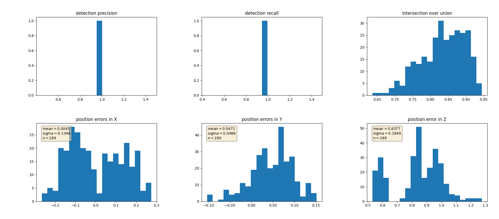

# Track 3D-Objects Over Time

### 1. Write a short recap of the four tracking steps and what you implemented there (filter, track management, association, camera fusion). Which results did you achieve? Which part of the project was most difficult for you to complete, and why?


### 2. Do you see any benefits in camera-lidar fusion compared to lidar-only tracking (in theory and in your concrete results)?


### 3. Which challenges will a sensor fusion system face in real-life scenarios? Did you see any of these challenges in the project?


### 4. Can you think of ways to improve your tracking results in the future?

This is a writeup submission for sensor fusion course  [Udacity Self-Driving Car Engineer Nanodegree Program](https://www.udacity.com/course/c-plus-plus-nanodegree--nd213) : 3D Object Detection (Midterm).

## 3D Object detection

We have used the [Waymo Open Dataset's](https://console.cloud.google.com/storage/browser/waymo_open_dataset_v_1_2_0_individual_files) real-world data and used 3d point cloud for lidar based object detection.

The steps included were -

- Map the ranges channel to 8 bit and view the range /intensity image (ID_S1_EX1)
- Use the Open3D library to display a 3d rendering of 10 lidar point clouds (ID_S1_EX2)
- Create Birds Eye View perspective (BEV) of the point cloud, assign lidar intensity values to BEV, normalize the heightmap of each BEV (ID_S2_EX1,ID_S2_EX2,ID_S2_EX3)
- Use [YOLO repository](https://review.udacity.com/github.com/maudzung/SFA3D) and add parameters to setup fpn resnet model(ID_S3_EX1)
- Convert BEV coordinates into pixel coordinates and convert model output to generate bounding boxes (ID_S3_EX2)
- Compute intersection over union, treat detections as objects if IOU exceeds threshold (ID_S4_EX1)
- Compute false positives and false negatives, precision and recall(ID_S4_EX2,ID_S4_EX3)


The project can be run by executing

```
python loop_over_dataset.py
```

All training was done in the workspace provided by Udacity


## Step-1: Compute Lidar point cloud from Range Image

In this step, we first previewing the range image and then convert range and intensity channels to 8 bit format. Next, we use the openCV library to stack the range and intensity channel vertically to visualize the image.

- Convert "range" channel to 8 bit
- Convert "intensity" channel to 8 bit
- Stack up range and intensity channels vertically in openCV


Changes to the "objdet_pcl.py" file
```
# visualize lidar point-cloud
def show_pcl(pcl):

    ####### ID_S1_EX2 START #######     
    #######
    print("student task ID_S1_EX2")

    # step 1 : initialize open3d with key callback and create window
    vis_lpc = o3d.visualization.VisualizerWithKeyCallback()
    vis_lpc.create_window(window_name='Open3D', width=1280, height=1080, left=50, top=50, visible=True)

    global idx
    idx= True
    def right_click(vis_lpc):
        global idx
        print('right arrow pressed')
        idx= False
        return
    vis_lpc.register_key_callback(262,right_click)

    # step 2 : create instance of open3d point-cloud class
    pcd = o3d.geometry.PointCloud()

    # step 3 : set points in pcd instance by converting the point-cloud into 3d vectors (using open3d function Vector3dVector)
    pcd.points = o3d.utility.Vector3dVector(pcl[:,:3])

    # step 4 : for the first frame, add the pcd instance to visualization using add_geometry; for all other frames, use update_geometry instead
    vis_lpc.add_geometry(pcd)

    # step 5 : visualize point cloud and keep window open until right-arrow is pressed (key-code 262)
    while idx:
        vis_lpc.poll_events()
        vis_lpc.update_renderer()

    #######
    ####### ID_S1_EX2 END #######     
```

Using the following settings
```
data_filename = 'training_segment-1005081002024129653_5313_150_5333_150_with_camera_labels.tfrecord
show_only_frames = [0, 1]
exec_data = []
exec_detection = []
exec_tracking = []
exec_visualization = ['show_range_image']
```


Next we visualize the point cloud in Open3D and show 10 examples of vehicles in the point clouds


## Step-2: Create Birds-Eye View from Lidar PCL

In this step we create the BEV perspective of the point cloud image.

We do this by -

- Convert the coordinates to pixel values
- Assign lidar intensity values to the birds eye view BEV mapping
- Use sorted and pruned intensity values from the previous task
- Normalize the height map in the BEV
- Compute and map the intensity values


Changes to the "objdet_pcl.py" file

```
# create birds-eye view of lidar data
def bev_from_pcl(lidar_pcl, configs):

    # remove lidar points outside detection area and with too low reflectivity
    mask = np.where((lidar_pcl[:, 0] >= configs.lim_x[0]) & (lidar_pcl[:, 0] <= configs.lim_x[1]) &
                    (lidar_pcl[:, 1] >= configs.lim_y[0]) & (lidar_pcl[:, 1] <= configs.lim_y[1]) &
                    (lidar_pcl[:, 2] >= configs.lim_z[0]) & (lidar_pcl[:, 2] <= configs.lim_z[1]))
    lidar_pcl = lidar_pcl[mask]

    # shift level of ground plane to avoid flipping from 0 to 255 for neighboring pixels
    lidar_pcl[:, 2] = lidar_pcl[:, 2] - configs.lim_z[0]  

    # convert sensor coordinates to bev-map coordinates (center is bottom-middle)
    ####### ID_S2_EX1 START #######     
    #######
    print("student task ID_S2_EX1")

    ## step 1 :  compute bev-map discretization by dividing x-range by the bev-image height (see configs)
    bev_discret = (configs.lim_x[1] - configs.lim_x[0]) / configs.bev_height

    ## step 2 : create a copy of the lidar pcl and transform all metrix x-coordinates into bev-image coordinates    
    lidar_pcl_cpy = np.copy(lidar_pcl)
    lidar_pcl_cpy[:, 0] = np.int_(np.floor(lidar_pcl_cpy[:, 0] / bev_discret))

    # step 3 : perform the same operation as in step 2 for the y-coordinates but make sure that no negative bev-coordinates occur
    lidar_pcl_cpy[:, 1] = np.int_(np.floor(lidar_pcl_cpy[:, 1] / bev_discret) + (configs.bev_width + 1) / 2)
    lidar_pcl_cpy[:, 1] = np.abs(lidar_pcl_cpy[:,1])

    # step 4 : visualize point-cloud using the function show_pcl from a previous task
    show_pcl(lidar_pcl_cpy)
    #######
    ####### ID_S2_EX1 END #######     


    # Compute intensity layer of the BEV map
    ####### ID_S2_EX2 START #######     
    #######
    print("student task ID_S2_EX2")

    ## step 1 : create a numpy array filled with zeros which has the same dimensions as the BEV map
    intensity_map = np.zeros((configs.bev_height, configs.bev_width))   

    # step 2 : re-arrange elements in lidar_pcl_cpy by sorting first by x, then y, then -z (use numpy.lexsort)
    lidar_pcl_cpy[lidar_pcl_cpy[:,3]>1.0,3] = 1.0
    idx_intensity = np.lexsort((-lidar_pcl_cpy[:, 2], lidar_pcl_cpy[:, 1], lidar_pcl_cpy[:, 0]))
    lidar_pcl_top = lidar_pcl_cpy[idx_intensity]

    ## step 3 : extract all points with identical x and y such that only the top-most z-coordinate is kept (use numpy.unique)
    ##          also, store the number of points per x,y-cell in a variable named "counts" for use in the next task
    lidar_pcl_int, indices, count = np.unique(lidar_pcl_cpy[:, 0:2], axis=0, return_index=True, return_counts=True)
    lidar_pcl_top = lidar_pcl_cpy[indices]

    ## step 4 : assign the intensity value of each unique entry in lidar_top_pcl to the intensity map
    ##          make sure that the intensity is scaled in such a way that objects of interest (e.g. vehicles) are clearly visible    
    ##          also, make sure that the influence of outliers is mitigated by normalizing intensity on the difference between the max. and min. value within the point cloud
    intensity_map[np.int_(lidar_pcl_top[:, 0]),
                  np.int_(lidar_pcl_top[:, 1])] = lidar_pcl_top[:, 3] / (np.amax(lidar_pcl_top[:, 3])-np.amin(lidar_pcl_top[:, 3]))

    ## step 5 : temporarily visualize the intensity map using OpenCV to make sure that vehicles separate well from the background
    img_intensity = intensity_map * 256
    img_intensity = img_intensity.astype(np.uint8)
    # cv2.imshow('img_intensity', img_intensity)
    # cv2.waitKey(0)
    # cv2.destroyAllWindows()
    #######
    ####### ID_S2_EX2 END #######


    # Compute height layer of the BEV map
    ####### ID_S2_EX3 START #######     
    #######
    print("student task ID_S2_EX3")

    ## step 1 : create a numpy array filled with zeros which has the same dimensions as the BEV map
    height_map = np.zeros((configs.bev_height, configs.bev_width))

    ## step 2 : assign the height value of each unique entry in lidar_top_pcl to the height map
    ##          make sure that each entry is normalized on the difference between the upper and lower height defined in the config file
    ##          use the lidar_pcl_top data structure from the previous task to access the pixels of the height_map
    height_map[np.int_(lidar_pcl_top[:, 0]), np.int_(lidar_pcl_top[:, 1])] = lidar_pcl_top[:, 2] / float(np.abs(configs.lim_z[1] - configs.lim_z[0]))

    ## step 3 : temporarily visualize the intensity map using OpenCV to make sure that vehicles separate well from the background
    img_height = height_map * 256
    img_height = img_height.astype(np.uint8)
    # cv2.imshow('height_map', height_map)
    # cv2.waitKey(0)
    # cv2.destroyAllWindows()

    #######
    ####### ID_S2_EX3 END #######       

    # TODO remove after implementing all of the above steps

    # Compute density layer of the BEV map
    density_map = np.zeros((configs.bev_height + 1, configs.bev_width + 1))
    _, _, counts = np.unique(lidar_pcl_cpy[:, 0:2], axis=0, return_index=True, return_counts=True)
    normalizedCounts = np.minimum(1.0, np.log(counts + 1) / np.log(64))
    density_map[np.int_(lidar_pcl_top[:, 0]), np.int_(lidar_pcl_top[:, 1])] = normalizedCounts

    # assemble 3-channel bev-map from individual maps
    bev_map = np.zeros((3, configs.bev_height, configs.bev_width))
    bev_map[2, :, :] = density_map[:configs.bev_height, :configs.bev_width]  # r_map
    bev_map[1, :, :] = height_map[:configs.bev_height, :configs.bev_width]  # g_map
    bev_map[0, :, :] = intensity_map[:configs.bev_height, :configs.bev_width]  # b_map

    # expand dimension of bev_map before converting into a tensor
    s1, s2, s3 = bev_map.shape
    bev_maps = np.zeros((1, s1, s2, s3))
    bev_maps[0] = bev_map

    bev_maps = torch.from_numpy(bev_maps)  # create tensor from birds-eye view
    input_bev_maps = bev_maps.to(configs.device, non_blocking=True).float()
    return input_bev_maps

```

Using the following settings
```
data_filename = 'training_segment-1005081002024129653_5313_150_5333_150_with_camera_labels.tfrecord
show_only_frames = [0, 1]
exec_data = ['pcl_from_rangeimage']
exec_detection = ['bev_from_pcl']
exec_tracking = []
exec_visualization = []
```


## Step-3: Model-based Object Detection in BEV Image

Now we use a second model [fpn resnet](https://github.com/maudzung/SFA3D) and extract the relevant configurations from 'SFA3D->test.py->parse_test_configs()'  and added them in the 'load_configs_model' config structure.

Next we,
- Instantiate the fpn-resnet model using the cloned repository configs
- Extract 3d bounding boxes from the responses
- Transform the pixel to vehicle coordinates
- Model output tuned to the bounding box format [class-id, x, y, z, h, w, l, yaw]

Changes to the "objdet_detect.py" file
```
# detect trained objects in birds-eye view
def detect_objects(input_bev_maps, model, configs):

    # deactivate autograd engine during test to reduce memory usage and speed up computations
    with torch.no_grad():  

        # perform inference
        outputs = model(input_bev_maps)

        # decode model output into target object format
        if 'darknet' in configs.arch:

            # perform post-processing
            output_post = post_processing_v2(outputs, conf_thresh=configs.conf_thresh, nms_thresh=configs.nms_thresh)
            detections = []
            for sample_i in range(len(output_post)):
                if output_post[sample_i] is None:
                    continue
                detection = output_post[sample_i]
                for obj in detection:
                    x, y, w, l, im, re, _, _, _ = obj
                    yaw = np.arctan2(im, re)
                    detections.append([1, x, y, 0.0, 1.50, w, l, yaw])    

        elif 'fpn_resnet' in configs.arch:
            # decode output and perform post-processing

            ####### ID_S3_EX1-5 START #######     
            #######
            print("student task ID_S3_EX1-5")
            outputs['hm_cen'] = _sigmoid(outputs['hm_cen'])
            outputs['cen_offset'] = _sigmoid(outputs['cen_offset'])
            # detections size (batch_size, K, 10)
            detections = decode(outputs['hm_cen'], outputs['cen_offset'], outputs['direction'], outputs['z_coor'],
                                outputs['dim'], K=40) #K=configs.k
            detections = detections.cpu().numpy().astype(np.float32)
            # print(detections)
            detections = post_processing(detections, configs)
            detections = detections[0][1]
            print(detections)
            #######
            ####### ID_S3_EX1-5 END #######     


    ####### ID_S3_EX2 START #######     
    #######
    # Extract 3d bounding boxes from model response
    print("student task ID_S3_EX2")
    objects = []

    ## step 1 : check whether there are any detections
    for obj in detections:
        id, bev_x, bev_y, z, h, bev_w, bev_l, yaw = obj
        ## step 2 : loop over all detections
        x = bev_y / configs.bev_height * (configs.lim_x[1] - configs.lim_x[0])
        y = bev_x / configs.bev_width * (configs.lim_y[1] - configs.lim_y[0]) - (configs.lim_y[1] - configs.lim_y[0])/2.0
        w = bev_w / configs.bev_width * (configs.lim_y[1] - configs.lim_y[0])
        l = bev_l / configs.bev_height * (configs.lim_x[1] - configs.lim_x[0])
        ## step 3 : perform the conversion using the limits for x, y and z set in the configs structure
        if ((x >= configs.lim_x[0]) and (x <= configs.lim_x[1])
            and (y >= configs.lim_y[0]) and (y <= configs.lim_y[1])
            and (z >= configs.lim_z[0]) and (z <= configs.lim_z[1])):
            ## step 4 : append the current object to the 'objects' array
            objects.append([1, x, y, z, h, w, l, yaw])

    #######
    ####### ID_S3_EX2 START #######   

    return objects    
```

Not all the changes are mentioned here. For additional changes refer to "objdet_detect.py"

Using the following settings
```
data_filename = 'training_segment-1005081002024129653_5313_150_5333_150_with_camera_labels.tfrecord
show_only_frames = [50, 51]
exec_data = ['pcl_from_rangeimage', 'load_image']
exec_detection = ['bev_from_pcl', 'detect_objects']
exec_tracking = []
exec_visualization = ['show_objects_in_bev_labels_in_camera']
configs_det = det.load_configs(model_name="fpn_resnet")
```


## Step-4: Performance Evaluation for Object Detection


Next, the performance is evaluated by getting the IOU between labels and detections to get the false positive and false negative values. This is done by computing the geometric overlap between the bounding boxes of labels and the detected objects. For this we,

- Assign a detected object to a label if IOU exceeds threshold
- Compute the degree of geometric overlap
- For multiple matches objects/detections pair, the tie is broken using the maximum IOU
- Compute the false negative and false positive values
- Compute precision and recall over the false positive and false negative values


Changes to the "objdet_eval.py" file
```
# evaluate object detection performance based on all frames
def compute_performance_stats(det_performance_all, configs_det):

    # extract elements
    ious = []
    center_devs = []
    pos_negs = []
    for item in det_performance_all:
        ious.append(item[0])
        center_devs.append(item[1])
        pos_negs.append(item[2])

    ####### ID_S4_EX3 START #######     
    #######    
    print('student task ID_S4_EX3')

    ## step 1 : extract the total number of positives, true positives, false negatives and false positives
    _, true_positives, false_negatives, false_positives = np.sum(pos_negs, axis = 0)

    ## step 2 : compute precision
    precision = true_positives /float(true_positives + false_positives)

    ## step 3 : compute recall
    recall = true_positives / float(true_positives + false_negatives) # What are the chances of a real object being detected?

    #######    
    ####### ID_S4_EX3 END #######     
    print('precision = ' + str(precision) + ", recall = " + str(recall))   

    # serialize intersection-over-union and deviations in x,y,z
    ious_all = [element for tupl in ious for element in tupl]
    devs_x_all = []
    devs_y_all = []
    devs_z_all = []
    for tuple in center_devs:
        for elem in tuple:
            dev_x, dev_y, dev_z = elem
            devs_x_all.append(dev_x)
            devs_y_all.append(dev_y)
            devs_z_all.append(dev_z)


    # compute statistics
    stdev__ious = np.std(ious_all)
    mean__ious = np.mean(ious_all)

    stdev__devx = np.std(devs_x_all)
    mean__devx = np.mean(devs_x_all)

    stdev__devy = np.std(devs_y_all)
    mean__devy = np.mean(devs_y_all)

    stdev__devz = np.std(devs_z_all)
    mean__devz = np.mean(devs_z_all)
    #std_dev_x = np.std(devs_x)

    # plot results
    data = [precision, recall, ious_all, devs_x_all, devs_y_all, devs_z_all]
    titles = ['detection precision', 'detection recall', 'intersection over union', 'position errors in X', 'position errors in Y', 'position error in Z']
    textboxes = ['', '', '',
                 '\n'.join((r'$\mathrm{mean}=%.4f$' % (np.mean(devs_x_all), ), r'$\mathrm{sigma}=%.4f$' % (np.std(devs_x_all), ), r'$\mathrm{n}=%.0f$' % (len(devs_x_all), ))),
                 '\n'.join((r'$\mathrm{mean}=%.4f$' % (np.mean(devs_y_all), ), r'$\mathrm{sigma}=%.4f$' % (np.std(devs_y_all), ), r'$\mathrm{n}=%.0f$' % (len(devs_x_all), ))),
                 '\n'.join((r'$\mathrm{mean}=%.4f$' % (np.mean(devs_z_all), ), r'$\mathrm{sigma}=%.4f$' % (np.std(devs_z_all), ), r'$\mathrm{n}=%.0f$' % (len(devs_x_all), )))]

    f, a = plt.subplots(2, 3)
    a = a.ravel()
    num_bins = 20
    props = dict(boxstyle='round', facecolor='wheat', alpha=0.5)
    for idx, ax in enumerate(a):
        ax.hist(data[idx], num_bins)
        ax.set_title(titles[idx])
        if textboxes[idx]:
            ax.text(0.05, 0.95, textboxes[idx], transform=ax.transAxes, fontsize=10,
                    verticalalignment='top', bbox=props)
    plt.tight_layout()
    plt.show()


```

Using the following settings
```
data_filename = 'training_segment-1005081002024129653_5313_150_5333_150_with_camera_labels.tfrecord
show_only_frames = [50, 150]
exec_data = ['pcl_from_rangeimage']
exec_detection = ['bev_from_pcl', 'detect_objects', 'validate_object_labels', 'measure_detection_performance']
exec_tracking = []
exec_visualization = ['show_detection_performance']
configs_det = det.load_configs(model_name="darknet")
```



## Summary
From this project we get some analysis of the applicability of LiDAR based object detection. The conversion of LiDAR range data to spatial volumes or 3D points are important for further analysis. The usage of resnet and YOLO for 3D detection is important. Neural Nets have the power to extract information from data of such high dimensionality. Evaluating the performance with help of standard maximal IOU mapping, mAP and representing the precision/recall of the bounding boxes are essential to showcase the performance of the system.
